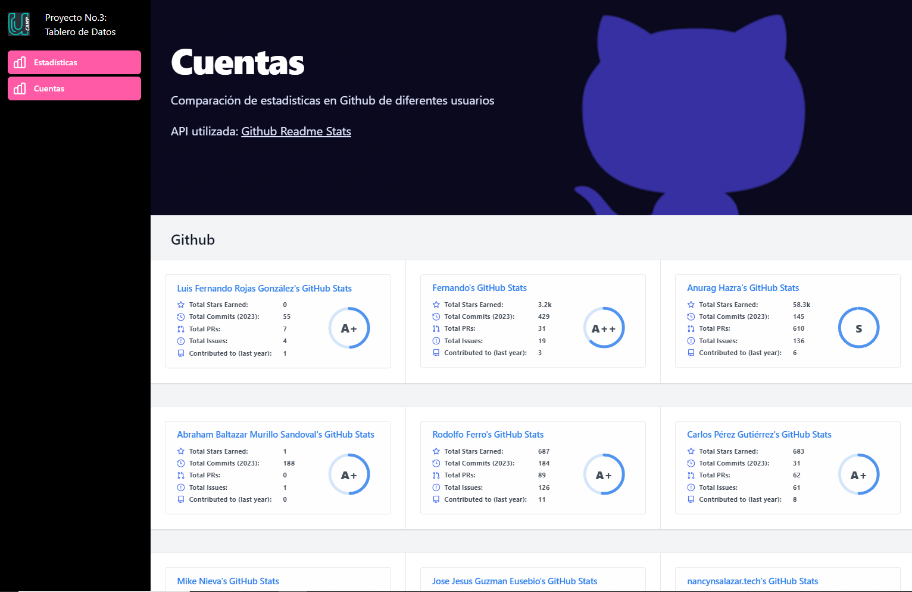

# Proyecto 3: Dashboard

Dashboard que utiliza el API gratuito "GitHub ReadMe Stats" que permite agregar estadisticos de Github. Obtenido de [GitHub Public APIs](https://github.com/public-apis/public-apis#open-source-projects)

El dashboard fue creado utilizando Javascript y funciones nativas del lenguaje para entender su funcionamiento en el Bootcamp FullStack Developer de Ucamp
